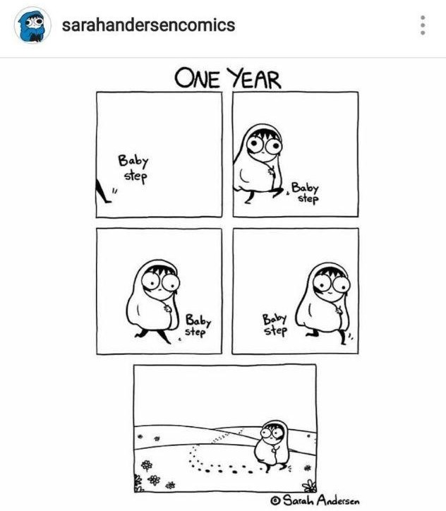

Note - When your dreams feel too far fetched just know that even the baby steps do count! I was inspired to write this poem after I saw a comic by @sarahandersencomics on instagram.

{:class="img-responsive" .align-center width="50%"}

Here's the poem - 

One day,  
All those baby steps will take you  
To where you truly belong.  
The little things you do,  
Will soon pay off.  
It may take you a while.  
The path may be long.  
It may set you off track.  
But be patient  
You'll get there.  
As long as you don't just stand there  
Even the smallest of steps does count.  
Come on now,  
Set course and steer straight ahead.  
The bumps and bruises,  
Along the way,  
Are a small price to pay.  
For what you seek  
Is what most are afraid of.  
Don't let their fear get to you.  
Don't you ever stop trying.  
Be it a stride or a leap,  
Even the baby steps do count.  

-- Nikitha

